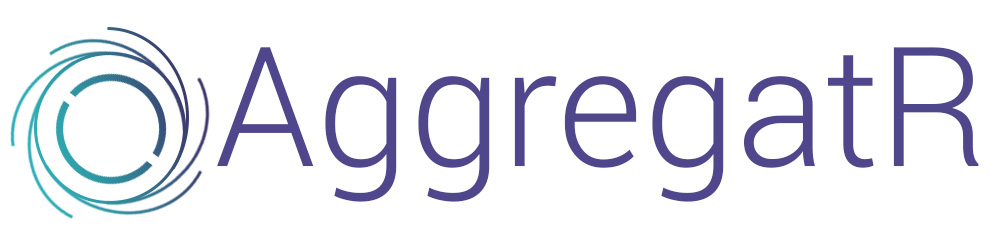

**Aggregatr** is a community driven website that facilitates the sharing of best resources  on popular programming languages.

## How Aggregator is structured

Content on the website is divided into Categories (_programming languages_) which are further divded down into sub-categories (_libraries, frameworks etc_) and finally the content type eg: _blog post, youtube video, online course, podcast etc_.

### How content is ranked

The primary goal of the website is to make available to you the best of the best resources in any category without any SEO trampering with the results.
All articles, blog posts courses etc are voted on by members of the community and therefore the post with the highest number of up votes is therefore the best.

